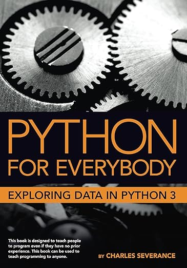
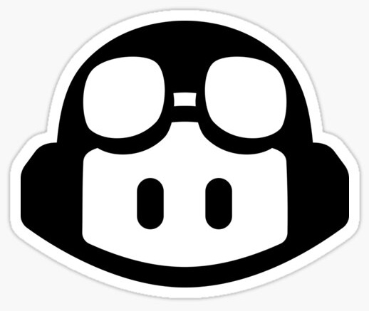
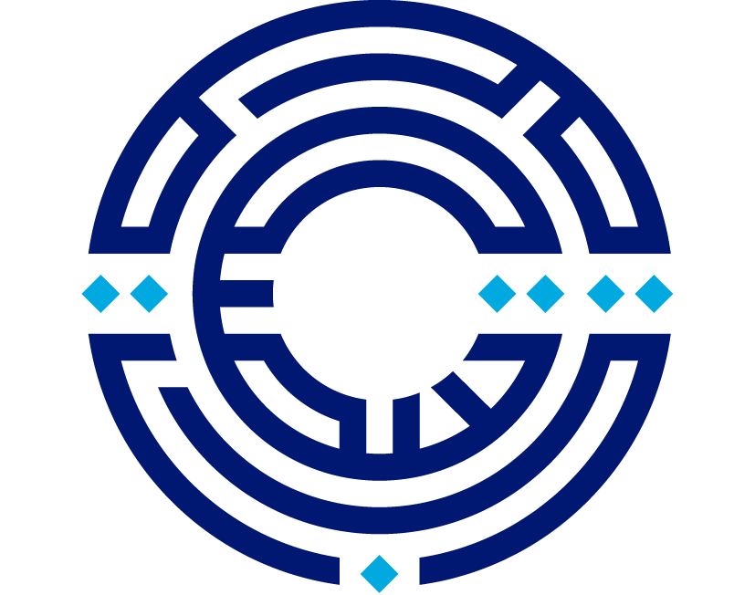

# 11102: Introduction to Computing
{:.no_toc}
Princess Sumaya University for Technology - Spring 2026
{:.no_toc}

## Table of contents
{: .no_toc .text-delta }

1. TOC
{:toc}

---

## Course Overview

Welcome! This course is a gentle (and hopefully fun) introduction to computing. We will use programming in Python as a vehicle for introducing some fundamentals of the field. As you learn how to program, you will develop skills that you need in your future courses and also explore applications in various computing areas, such as artificial intelligence, computer security, and image processing. You will also begin to appreciate what it takes to design and build large software systems. In short, this course will give you a taste of computing and prepare you for what lies ahead.

## Prerequisites

No prior programming experience is expected. Just bring your curiosity, a commitment to practice regularly, and enough perseverance to keep going when things get tricky.

## Textbooks

We will use the following two textbooks, both of which are available online for free. We will also use slides, notes, and other resources as necessary. The <a href='/11102-s26/schedule'>Schedule</a> page will learning material and which chapter(s) from which book are required.

    Severance, Charles R. <strong>Python for Everybody: Exploring Data Using Python 3</strong>, 2024.[<a href='https://do1.dr-chuck.com/pythonlearn/EN_us/pythonlearn.pdf'>PDF</a>][<a href='https://www.py4e.com/lessons'>Online Lessons</a>]

  Downey, Allen. <strong>Think Python: How to Think Like a Computer Scientist</strong>, 3rd ed., O'Reilly Media, 2024.[<a href='https://allendowney.github.io/ThinkPython/'>HTML</a>]

## Course Topics

The first 7 weeks of the semester will focus on programming in Python. Each of the remaining weeks will focus on an application area in computer science using hands-on projects and examples. Here is what you should expect to achieve by the end of the semester:

- Be able to **_read, trace, and modify_** simple programs in Python. 
- Be able to **_design and test_** small/medium-sized programs in Python.
- Understand how **_information is represented_** and stored on computers.
- Understand how to **_compare different algorithms_** for solving a problem.
- Perform basic **_manipulations of images_** using Python.
- Understand basic concepts in **_computer security_** like data integrity and confidentiality.
- Understand basic concepts related to **_machine learning and data analysis_**.

## Assessments & Grades

  <table class="grade-table">
    <thead>
      <tr> <th>Assessment</th>       
           <th>Weight</th>    
           <th>Description</th></tr>
    </thead>
    <tbody>
      <tr> <td>Exercises</td>        
           <td>5%</td>        
           <td>11 problem sets due at the end of every week. The lowest is automatically dropped.</td>
           </tr>
      <tr> <td>Self Assessments</td> 
           <td>5%</td>        
           <td>11 quizzes for self assessment purposes done at home and due at the end of every week. The lowest is automatically dropped.</td></tr>
      <tr> <td>Quizzes</td>          
           <td>12%</td>        
           <td>Two quizzes done in class, each worth 6%.</td></tr>
      <tr> <td>Assignments</td>   
           <td>8%</td>       
           <td>Details will be posted on the <a href='/11102-s26/assignments'>Assignments</a> page.</td></tr>
      <tr> <td>Midterm Exam</td>     
           <td>30%</td>       
           <td>The exact date and time will be set by the university.</td></tr>
      <tr> <td>Final Exam</td>       
           <td>40%</td>       
           <td>The exact date and time will be set by the university.</td></tr>
    </tbody>
    <tfoot>
      <tr><td>Total</td>
      <td>100%</td>
      <td></td></tr>
    </tfoot>
  </table>

## Tools

  <strong>Python</strong> 
  We will learn programming in python! [<a href='https://www.python.org/downloads/'>download</a>]

  <strong>VS Code</strong> 
  This is the IDE (Integrated Development Environment) you will use for programming in Python. While you are allowed to use other IDEs, this is the one we will use in the classroom, base the course material on, and provide support for. [<a href='https://code.visualstudio.com/download'>download</a>] [<a href='https://marketplace.visualstudio.com/items?itemName=ms-python.python'>configure python</a>]

  <strong>GitHub Copilot</strong> 
  This is a GenAI assistant for programming that we will use as a plugin in VSCode. [<a href='https://marketplace.visualstudio.com/items?itemName=GitHub.copilot'>install</a>]

  
  

    <strong>EdStem</strong> 
    This is where you will ask questions, interact with your instructors and classmates, and solve the weekly exercises and self-assessments. You will receive an email invitation to create an account and join the course. [<a href='https://edstem.org/us/courses/87448'>Direct Link to Course</a>]
  

  
  

    <strong>E-Learning System</strong> 
    We will use this system for the midterm and final exams. Your instructor might also use this system for communicating things specific to your section, rather than the course as a whole.
  

